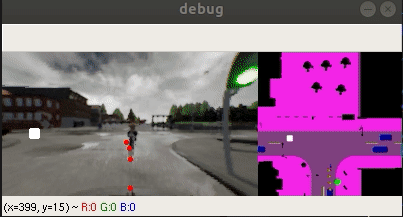
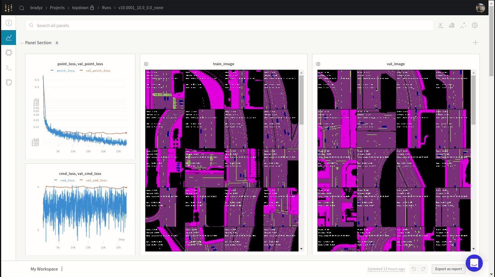

# Learning by Cheating


> [**Learning by Cheating**](https://arxiv.org/abs/1912.12294)    
> Dian Chen, Brady Zhou, Vladlen Koltun, Philipp Kr&auml;henb&uuml;hl,        
> [Conference on Robot Learning](https://www.robot-learning.org) (CoRL 2019)      
> _arXiv 1912.12294_

If you find our repo to be useful in your research, please consider citing our work
```
@inproceedings{chen2019lbc
  author    = {Dian Chen and Brady Zhou and Vladlen Koltun and Philipp Kr\"ahenb\"uhl},
  title     = {Learning by Cheating},
  booktitle = {Conference on Robot Learning (CoRL)},
  year      = {2019},
}
```

## Installation

Clone this repo with all its submodules

```bash
git clone https://github.com/bradyz/2020_CARLA_challenge.git --recursive
```

All python packages used are specified in `carla_project/requirements.txt`.

You will also need to install CARLA 0.9.8, along with the additional maps.
See [link](https://github.com/carla-simulator/carla/releases/tag/0.9.8) for more instructions.

## Dataset

We provide a dataset of over 70k samples collected over the 75 routes provided in `leaderboard/data/routes_*.xml`.

[Link to full dataset (9 GB)](https://drive.google.com/file/d/1dwt9_EvXB1a6ihlMVMyYx0Bw0mN27SLy/view?usp=sharing).



The dataset is collected using `scenario_runner/team_code/autopilot.py`, using painfully hand-designed rules (i.e. if pedestrian is 5 meters ahead, then brake).

Additionally, we change the weather for a single route once every couple of seconds to add visual diversity as a sort of on-the-fly augmentation.
The simulator is run at 20 FPS, and we save the following data at 2 Hz.

* Left, Center, and Right RGB Images at 256 x 144 resolution
* A semantic segmentation rendered in the overhead view
* World position and heading
* Raw control (steer, throttle, brake)

Note: the overhead view does nothing to address obstructions, like overhead highways, etc.

We provide a sample trajectory in `sample_data`, which you can visualize by running

```
python3 -m carla_project.src.dataset sample_data/route_00/
```

## Data Collection

The autopilot that we used to collect the data can use a lot of work and currently does not support stop signs.

If you're interested in recollecting data after changing the autopilot's driving behavior in `scenario_runner/team_code/autopilot.py`, you can collect your own dataset by running the following.

```bash
export CARLA_ROOT=/home/bradyzhou/software/CARLA_0.9.8      # change to where you installed CARLA
export PORT=2000                                            # change to port that CARLA is running on
export ROUTES=leaderboard/data/routes/route_00.xml          # change to desired route
export TEAM_AGENT=scenario_runner/team_code/auto_pilot.py   # no need to change
export TEAM_CONFIG=sample_data                              # change path to save data

./run_agent.sh
```

## Run a pretrained model

Download the checkpoint from here and run the following.

```bash
export CARLA_ROOT=/home/bradyzhou/software/CARLA_0.9.8      # change to where you installed CARLA
export PORT=2000                                            # change to port that CARLA is running on
export ROUTES=leaderboard/data/routes/route_00.xml          # change to desired route
export TEAM_AGENT=scenario_runner/team_code/image_agent.py  # no need to change
export TEAM_CONFIG=model.ckpt                               # change path to checkpoint

./run_agent.sh
```

## Training models from scratch

First, download and extract our provided dataset.

Then run the stage 1 training of the privileged agent.

```python
python3 -m carla_project/src/map_model --dataset_dir /path/to/data
```

We use wandb for logging, so navigate to the generated experiment page to visualize training.



If you're interested in tuning hyperparameters, see `carla_project/src/map_model.py` for more detail.

Training the sensorimotor agent (acts only on raw images) is similar, and can be done by

```python
python3 -m carla_project/src/image_model --dataset_dir /path/to/data
```

## Docker

Build the docker container to submit

```bash
sudo ./scripts/make_docker.sh
```

Run the docker container.

```bash
sudo docker run --net=host --gpus all -e NVIDIA_VISIBLE_DEVICES=0 -e REPETITIONS=1 -e DEBUG_CHALLENGE=0 -e PORT=2000 -e ROUTES=leaderboard/data/routes_devtest.xml -e CHECKPOINT_ENDPOINT=tmp.txt -e SCENARIOS=leaderboard/data/all_towns_traffic_scenarios_public.json leaderboard-user:latest ./leaderboard/scripts/run_evaluation.sh
```

Run your docker container in interactive mode

```bash
sudo docker run --net=host --gpus all -it leaderboard-user:latest /bin/bas
```

Run the evaluation through the interactive shell.

```bash
export PORT=2000
export DEBUG_CHALLENGE=0
export REPETITIONS=1
export ROUTES=leaderboard/data/routes_devtest.xml
export CHECKPOINT_ENDPOINT=tmp.txt
export SCENARIOS=leaderboard/data/all_towns_traffic_scenarios_public.json

conda activate python37

./leaderboard/scripts/run_evaluation.sh
```
